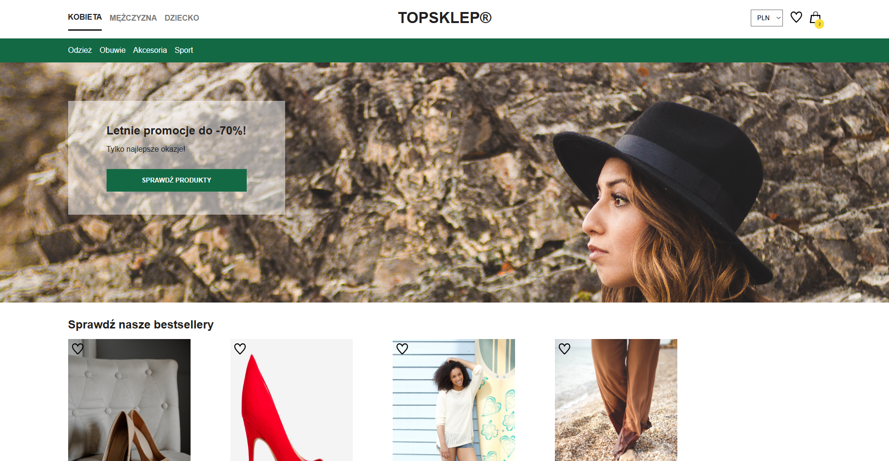
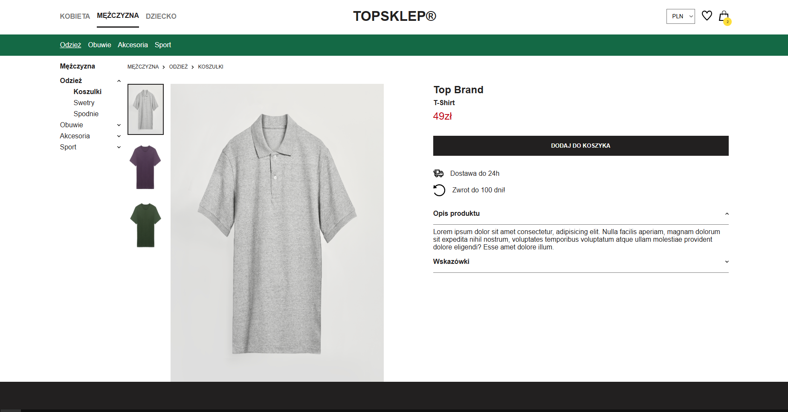
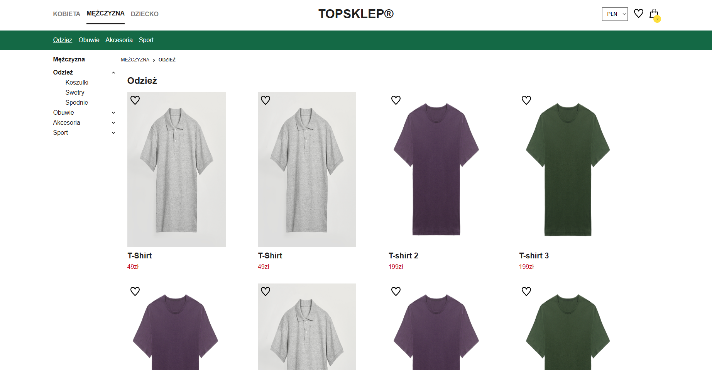
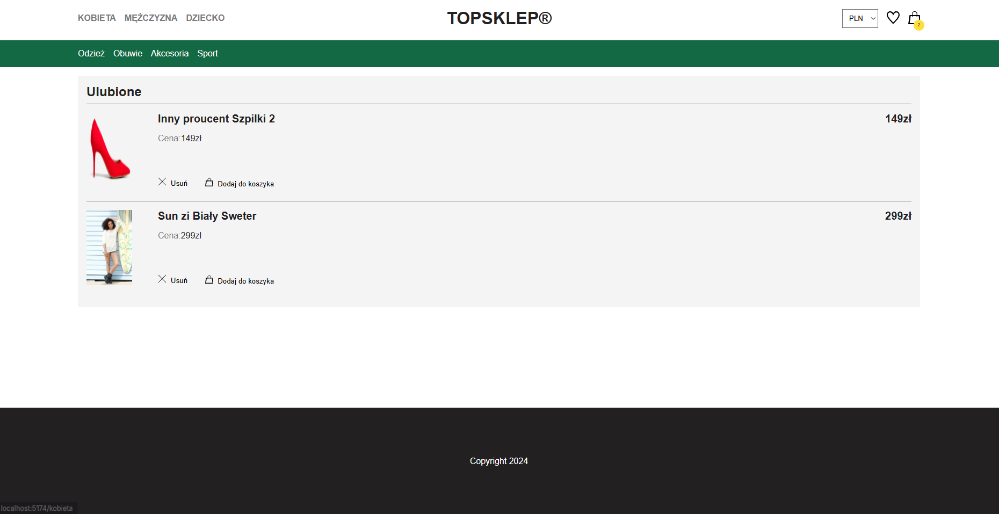
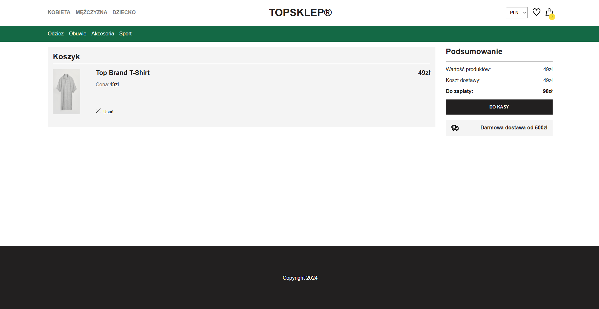

# 🛍️ React Shopping Cart App

A simple e-commerce app built with React as part of the _Zrozumieć React_ course. The app displays a product catalog with category filtering, allows users to add/remove items to a shopping cart, and preserves the cart in local storage.

## 🔧 Features

- Product catalog with images, titles, prices, and categories
- Category filter 
- Shopping cart functionality
  - Add/remove items
  - Update quantities
  - View total price
- Cart state persisted in `localStorage`
- Built using React `useReducer` for global state management
- Responsive layout

## 🛠 Tech Stack

- React (Functional Components)
- React Hooks (`useState`, `useReducer`, `useEffect`)
- CSS Modules
- `localStorage` for cart persistence

  ## **Screenshots**

/>
